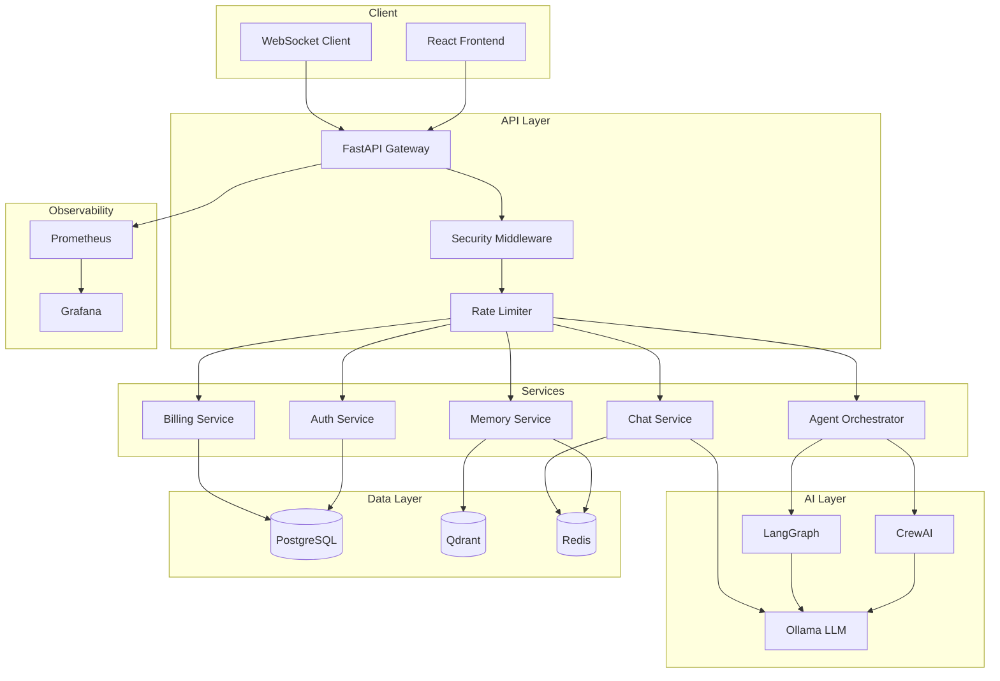
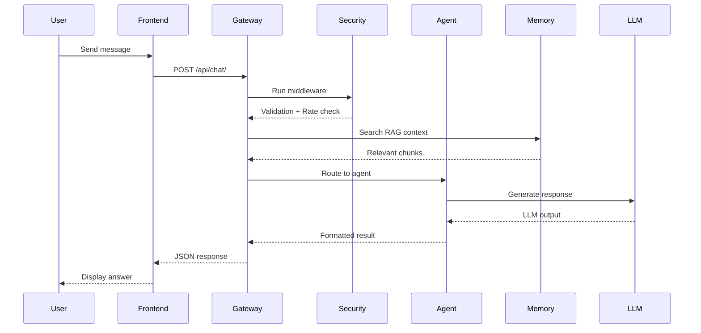
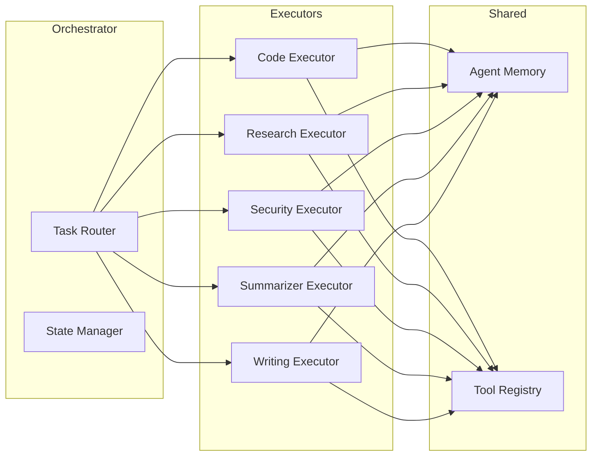
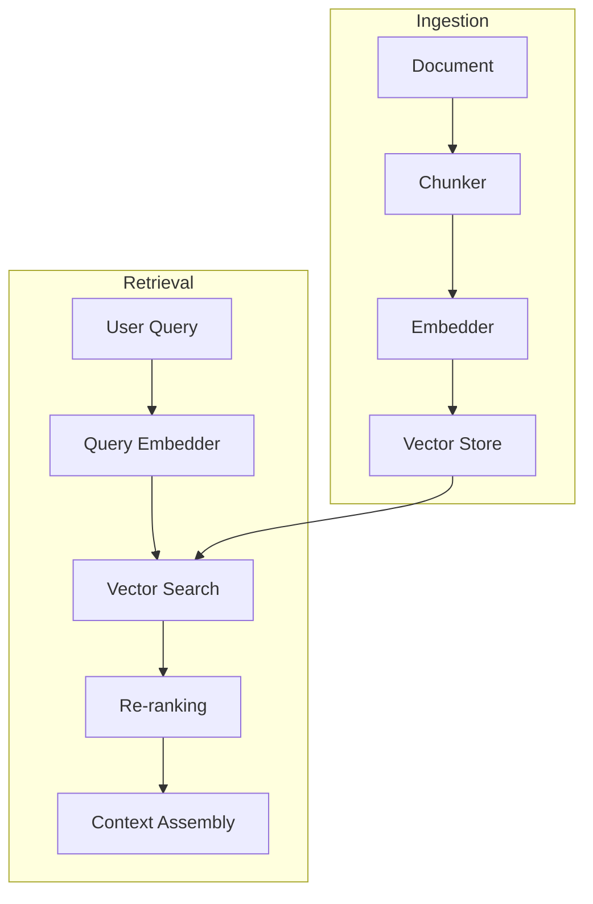
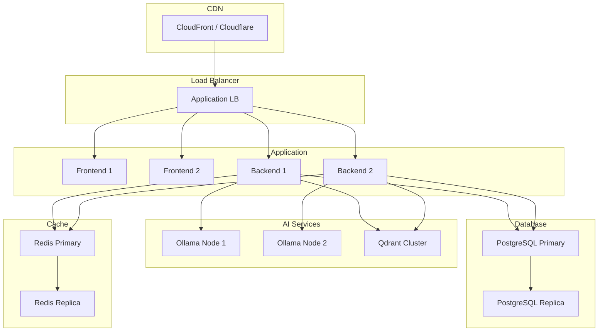

# Titanium Architecture

## System Overview

```mermaid
graph TB
    subgraph Client
        FE[React Frontend]
        WS[WebSocket Client]
    end

    subgraph API Layer
        GW[FastAPI Gateway]
        SEC[Security Middleware]
        RL[Rate Limiter]
    end

    subgraph Services
        AUTH[Auth Service]
        CHAT[Chat Service]
        MEM[Memory Service]
        AGT[Agent Orchestrator]
        BILL[Billing Service]
    end

    subgraph AI Layer
        CREW[CrewAI]
        LANG[LangGraph]
        OLLA[Ollama LLM]
    end

    subgraph Data Layer
        DB[(PostgreSQL)]
        VEC[(Qdrant)]
        RED[(Redis)]
    end

    subgraph Observability
        PROM[Prometheus]
        GRAF[Grafana]
    end

    FE --> GW
    WS --> GW
    GW --> SEC
    SEC --> RL
    RL --> AUTH
    RL --> CHAT
    RL --> MEM
    RL --> AGT
    RL --> BILL

    AGT --> CREW
    AGT --> LANG
    CREW --> OLLA
    LANG --> OLLA
    CHAT --> OLLA

    AUTH --> DB
    BILL --> DB
    MEM --> VEC
    MEM --> RED
    CHAT --> RED

    GW --> PROM
    PROM --> GRAF
```

## Data Flow

```mermaid
sequenceDiagram
    participant U as User
    participant F as Frontend
    participant G as Gateway
    participant S as Security
    participant A as Agent
    participant M as Memory
    participant L as LLM

    U->>F: Send message
    F->>G: POST /api/chat/
    G->>S: Run middleware
    S-->>G: Validation + Rate check
    G->>M: Search RAG context
    M-->>G: Relevant chunks
    G->>A: Route to agent
    A->>L: Generate response
    L-->>A: LLM output
    A-->>G: Formatted result
    G-->>F: JSON response
    F-->>U: Display answer
```

## Agent Architecture

```mermaid
graph LR
    subgraph Orchestrator
        ROUTE[Task Router]
        STATE[State Manager]
    end

    subgraph Executors
        CODE[Code Executor]
        RES[Research Executor]
        SEC[Security Executor]
        SUM[Summarizer Executor]
        WRITE[Writing Executor]
    end

    subgraph Shared
        MEM[Agent Memory]
        TOOLS[Tool Registry]
    end

    ROUTE --> CODE
    ROUTE --> RES
    ROUTE --> SEC
    ROUTE --> SUM
    ROUTE --> WRITE

    CODE --> TOOLS
    RES --> TOOLS
    SEC --> TOOLS
    SUM --> TOOLS
    WRITE --> TOOLS

    CODE --> MEM
    RES --> MEM
    SEC --> MEM
    SUM --> MEM
    WRITE --> MEM
```

## RAG Pipeline

```mermaid
graph TD
    subgraph Ingestion
        DOC[Document]
        CHUNK[Chunker]
        EMBED[Embedder]
        STORE[Vector Store]
    end

    subgraph Retrieval
        QUERY[User Query]
        QEMB[Query Embedder]
        SEARCH[Vector Search]
        RERANK[Re-ranking]
        CTX[Context Assembly]
    end

    DOC --> CHUNK
    CHUNK --> EMBED
    EMBED --> STORE

    QUERY --> QEMB
    QEMB --> SEARCH
    STORE --> SEARCH
    SEARCH --> RERANK
    RERANK --> CTX
```

## Deployment Architecture

```mermaid
graph TB
    subgraph CDN
        CF[CloudFront / Cloudflare]
    end

    subgraph Load Balancer
        ALB[Application LB]
    end

    subgraph Application
        FE1[Frontend 1]
        FE2[Frontend 2]
        BE1[Backend 1]
        BE2[Backend 2]
    end

    subgraph Database
        PG[PostgreSQL Primary]
        PGR[PostgreSQL Replica]
    end

    subgraph AI Services
        OLLA1[Ollama Node 1]
        OLLA2[Ollama Node 2]
        VEC[Qdrant Cluster]
    end

    subgraph Cache
        RED1[Redis Primary]
        RED2[Redis Replica]
    end

    CF --> ALB
    ALB --> FE1
    ALB --> FE2
    ALB --> BE1
    ALB --> BE2

    BE1 --> PG
    BE2 --> PG
    PG --> PGR

    BE1 --> RED1
    BE2 --> RED1
    RED1 --> RED2

    BE1 --> OLLA1
    BE2 --> OLLA2
    BE1 --> VEC
    BE2 --> VEC
```
